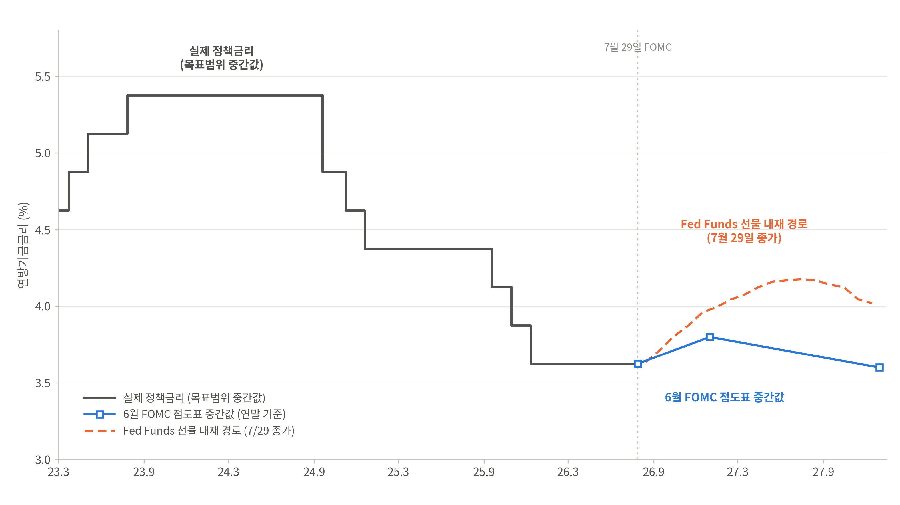
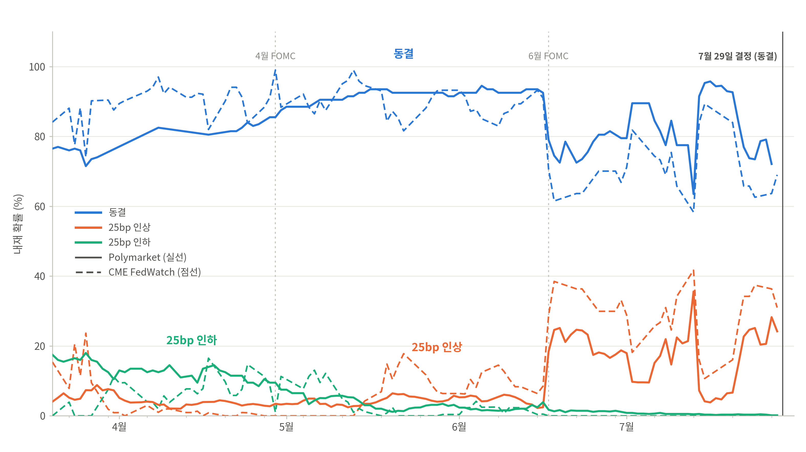

# 1. 7월 FOMC(2026.07.29) 요약[^3]

**그림 1: 시장은 점도표보다 매파적인 금리 경로를 반영하고 있다.** 

<small>자료: FRED(DFEDTARU), Federal Reserve SEP(2026년 6월), CBOT 30-Day Fed Funds 선물을 이용하여 저자 계산·작성. 주: 선물 내재 경로는 월별 계약가격(100−P)이며 OIS 선도금리의 대용 지표임.</small>

1. **FOMC는 금리를 동결했음**

2. 로건(Lorie Logan), 해맥(Beth Hammack), 카시카리(Neel Kashkari) 3명이 금리 인상을 주장하며 반대표를 던짐[^1][^2]

3. 위시 의장의 기자회견은 비둘기파적이었음. 주요 발언은 다음과 같음.
   - 6월 Core CPI가 컨센서스보다 낮게 나온 것이 7월 FOMC 결정에는 큰 영향을 미치지 않았다. 일부 데이터에 긍정적인 부분이 있었지만 이 흐름이 유지되는 것이 중요하다.
   - 시장금리 상승이 연준의 금리 인상을 대신할 수 있다. 연준이 금리를 인상하지 않은 이유는 이미 금리가 상승했기 때문이다.
   - AI는 투자는 향후 성장을 위한 토대를 마련하고 있음. AI가 공급 측면에 미치는 효과와 그 효과 발현의 정호가한 시기, 규모는 예측하기 어려움.
   - 데이터에 기반한 정책 결정의 문제는 바로 그 데이터와 그 데이터에 의존한다는 것. 중요한 것은 추세.
   - 물가가 높은 수준을 유지하면 금리 정책으로 대응하는 것도 방버 중 하나.
   - **물가안정과 최대고용은 양자택일의 관계가 아님. 양대책무 모두 달성할 것.**
   - 연준이 포워드 가이던스를 줄이면 FOMC 회의 사이에 나타나는 가격 움직임이 오히려 도움일 될 수 있다. 즉, 포워드 가이던스는 필요하지 않다.
   - PCE 하나만 보지 않겠지만 이 지수는 여전히 물가의 핵심판단 지수이며, 이를 계속 유지할 것.
   - **국채 수익률 커브나 달러가치를 보면 시장은 연준이 상황을 주도하고 있으며, 신뢰도를 갖추고 있다고 판단**
   - **가계와 기업들의 인내심이 악화되는 모습. 시장 가격은 대체로 금융환경이 긴축적으로 변했다고 보여짐.**

**그림 2: 7월 금리 인상 기대는 6월 FOMC를 기점으로 급부상했다.** 

<small>자료: Polymarket(CLOB API), CME Group(FedWatch Tool)을 이용하여 저자 계산·작성. 상세 주석은 부록 4.1 참조.</small>

4. 보통 FOMC는 발표 전에 확률이 95%이상으로 수렴한다. 이번 7월 FOMC는 양쪽 시장 모두 상당한 불확실성을 안고 발표를 맞았다. FOMC를 불과 며칠 앞두고 시장 전망이 이렇게 엇갈리는 것은 매우 이례적이다. 이는 포워드 가이던스의 부재와 여러 입장 차이에 기인함. 트럼프는 현지시각 27일, "매국이 세계에서 가장 낮은 금리를 가져야 한다. 워시의장은 훌륭하고 이사들은 매우 정치적익이다."라고 밝혔다. [^5] 반면, 프랭크 플라이트 시타델증권 거시전략 책임자는 현지시간 28일, "연준이 기준금리를 0.25%p"인상하면, 인플레이션을 잠재우겠다는 워시 의장의 거듭된 약속을 뒷받침하는 것이기 때문에 금리를 인상할 수 있다"고 블룸버그에 설명했다. 

5. 선물 내재 경로는 2026년 8월 3.64%에서 2027년 중반 4.17%까지 약 55bp 상승하는데, 이는 25bp 인상 2회 이상을 가격에 반영한 것이다. 7월 동결에도 불구하고 경로의 기울기가 우상향을 유지한다는 것은, 시장이 이번 동결을 인상 사이클의 취소가 아니라 **연기**로 해석했음을 뜻한다(그림1)
6. **시장은 인상 사이클이 짧을 것으로 본다.** 선물 경로가 2027년 중반 4.17%를 정점으로 연말 4.02%까지 꺾이는 것은, 추가 인상이 이뤄지더라도 1년 안에 완화로 되돌아간다는 "짧은 재긴축" 시나리오가 지배적 가격임을 보여준다.

# 2. 연준의 생각

## 2.1. 생산성과 물가[^6]

캐빈워시를 밀어준 재무장관 베센트의 논리는 이렇다.

AI가 생산성을 끌어올리면 물가 압력이 낮아지고 그럼 금리를 올릴 필요가 없다.

워시는 AI가 우리 생애 가장 강력한 생산성 향상의 물결이자 구조적으로 디스인플레적인힘이라고 발언하였다.

베센트는 "지금은 1990년대와 다르지 않은, 생산성 붐의 초기 단계"라고 발언하였다.

그러나 AI로 인한 생산성 개선이 역설적으로 금리 이상의 근거가 될 수 있다고 하는 입장도 존재한다.

30년전 연준의장인 그린스펀은 지금과 정확히 같은 질문을 마주했고, 답을 실제로 보여줬었다.

연준이 금리를 결정할 때 사용하는 것이 중립금리임, 즉 자연이자율

정책금리가 중립금리보다 위에 있으면 긴축적이며 반대면 완화적임

중립금리를 결정하는 것은 여러가지가 있겠지만, 딱 하나만 뽑자면 그 나라의 잠재 성장률임

2001년 라우바흐와 윌리엄스의 "Measuring the Natural Rate of Interest"페이퍼에 따르면

중립금리는 잠재성장률을 따라 움직인다.

윌리엄스는 지금 뉴욕 연은 총재이자 FOMC의 핵심 인물

잠재성장률은 "노동", "자본", "생산성"으로 결정이 됨.

생산성이 오르면 감재성장률이 올리간다. 이로인해 기업투자 수요와 돈에 대한 수요가 증갛나다. 돈에 대한 수요는 돈의 값어치를 올리고 이는 즉 금리가 올라가 중립금리도 올라간다는 것을 뜻함

가로축이 GDP, 세로축이 금리인 좌표계에서 잠재GDP와 IS곡선을 보자.

두 부분이 만나는 점에서 중립금리가 결정됨.

생산성이 향상되면 IS 곡선이 올라가고 잠재 GDP가 오른쪽으로 이동하게 됨.

이로 인해 중립금리가 올라감

그러나 생산성이 올라가면 공급이 커져 물건 값이 싸지며 이로 인해 물가 하방 압력이 발생함.

이 부분이 워시와 베센트가 보는 부분

어느쪽이 우세하냐? 이게 39년 전 그린스펀의 딜레마이다.

생산성이 안 올랐는데 돈만 많이 부으면 물가가 올라가고 중립금리가 올라가고 인상 이유가 됨.

즉, 이는 시간 지평에 대한 부분임

즉, 단기적으로는 상방압력, 장기적으로는 하방압력

1996년 그린스펀의 수수께끼

1966년 미국 경제는 교과서로 설명되지 않는 조합을 보이고 있었다.

실업률은 계속 낮아지며 임금은 계속 오르며 물가는 오르지 ㅇ낳는.

즉, 노동시장이 뜨거운데 물가가 잠잠하다. 이걸 그린스펀의 수수께끼라 부름

그린스펀은 그 답을, 눈에 보이지 않는 생산성에서 찾음.

임금은 빠르게 오르는데 물가는 잠잠하다면, 단위단 비용이 안 오른다(생산성이 오르고 있다)는 뜻읻.

그러나 당시 데이터로는 확신할 수 없없고, 정황을 종합한 결론에 가까움

그래서 그린스펀은 긴축에 제동을 걸었음.

산생선이 오르는게 맞다면 공급이 커지고 잠재성장률이 올라가며 성장이 빨라도 물가가 낮게 유지될 수 있기 때문이다. 따라서 서둘러 긴축할 이유가 없다는 생각.

이게 지금 워시와 베센트가  펴는 주장과 똑같음.

여기까진 그린스펀이 옳았음.

그러나 생산성에는 다른 얼굴이 있으며, 이에 관해 지독하게 파고들었던 사람이 리치몬드 연은 총재인 앨 브로더스임

워시는 점도표를 못미더워한다.

워시는 포워드 가이던스에 비판적이다.

그리고 이 포워드 가이던스의 핵심이 바로 점도표이다.

2021년의 그 유명한 실수 "인플레이션은 일시적이다" 포워드 가이던스에 집착하다 나왔다고 본다.

실제로 워시는 점을 안찍었음.

연준의 대차대조표 관린?

워시의 세 갈림길

1) QT를 재개하는 것.
2) 만약 QT를 한다면, 어느 속도로 줄일건가
3) RMP: 지준 관리용 단기채 매입을, 계속 굴릴까

워시는 중국을 제도와 기술 양며네서 미국 패권의 제 1도전자로 본다. 그의 개혁 구상은 대중 경쟁 위위를 향한 방안이다. 즉, 달러 패권, 물가 안정, 연준 개혁까지 동시에...

중국 렌즈도 양면임.

즉, 중국과의 경쟁을 기술의 속도전으로 본다면 긴축은 자해이며 통화 신뢰전으로 본다면 긴축이 국력임. 

워시가 이걸 빨리 AI에 자본을 투하하는 싸움을 보느냐, 건전한 통화로 버티는 장기전으로 보느냐에 따라 정책의 추가 기운다.

중국은 금과 달러를 양손에 동시에 쥐고 있다.

## 2.2. 연준의 대차대조표

# 3. 추가적인 담론

## 3.1. 케빈 워시(Kevin Warsh)와 FOMC

FOMC(Federal Open Market Committee, FOMC)는 12명으로 구성되는 연방준비제도(FRD) 산하의 위원회이다. 연 8회의 정례회의를 갖고 미국 기준금리를 결정한다. 이중 7명은 FRD 이사이며 5명은 연방준비은행(FED) 총재이다. 중요한 회의는 3 · 6 · 9 · 12월 회의이며, 1 · 4 · 7 · 10(또는 11)회의는 상대적으로 중요도가 덜하다. 전자에서 점도표(Dot Plot)과 경제전망요약(SEP)가 함께 공개되기 때문이다.

## 3.2. 절사평균 PCE(Trimmed Mean PCE)

# 4. Appendix

## 4.1. 그림1. 연방기금금리의 실제 경로와 향후 경로 전망: 6월 FOMC 점도표와 연방기금선물 내재 경로 비교

이 그림은 2023년 3월부터 2026년 7월까지 실현된 미국 연방기금금리의 경로와, 2026년 7월 29일 FOMC 결정 직후 시점에서 본 향후 경로에 대한 두 가지 전망을 함께 나타낸다. 검은 실선은 실제 정책금리로, 연방기금금리 목표범위의 중간값을 계단형으로 표시한 것이다(2023년 7월 고점 5.375%에서 2025년 12월까지 총 175bp 인하, 이후 2026년 7월 회의까지 3.625%에서 동결). 파란 사각 마커는 2026년 6월 17일 FOMC에서 공표된 경제전망(SEP) 점도표의 연말 기준 중간값으로, 2026년 말 3.8%, 2027년 말 3.6%이다. 주황 점선은 2026년 7월 29일 종가 기준 CBOT 30일 연방기금선물(ZQ)의 월물별 내재금리(100−선물가격)를 2026년 8월물부터 2027년 12월물까지 연결한 것으로, 시장이 가격에 반영한 향후 정책금리 경로를 나타낸다. 회색 수직 점선은 7월 29일 FOMC 결정일(동결)이며, 이 선의 왼쪽은 실적, 오른쪽은 전망에 해당한다. 선물 내재 경로는 OIS 선도금리의 대용 지표로 널리 쓰이나 두 가지 유의점이 있다. 첫째, 각 월물의 내재금리는 해당 월의 일평균 유효연방기금금리(EFFR)에 대한 기대이므로 FOMC 회의가 있는 달에는 회의 전후 금리가 혼합되어 나타난다. 둘째, 선물 가격에는 텀 프리미엄이 포함될 수 있어 순수한 기대 경로 대비 다소 상향 편의가 있을 수 있다. 자료: Federal Reserve, Summary of Economic Projections(2026년 6월 17일, https://www.federalreserve.gov/monetarypolicy/fomcprojtabl20260617.htm); FRED, Federal Funds Target Range – Upper Limit(DFEDTARU, https://fred.stlouisfed.org/series/DFEDTARU); CBOT 30-Day Federal Funds Futures(ZQ) 종가를 이용하여 저자 계산·작성.

## 4.2. 그림 2. 2026년 7월 FOMC 금리 결정에 대한 시장 내재 확률 추이: Polymarket과 CME FedWatch 비교 

이 그림은 2026년 7월 28~29일 FOMC 회의의 금리 결정 결과(동결·25bp 인상·25bp 인하)에 대해 두 시장이 부여한 확률의 일별 추이를 나타낸다. 실선은 Polymarket 예측시장에서 거래된 각 결과별 계약 가격(확률로 해석 가능, 일별 종가)이며, 점선은 CME FedWatch Tool이 30일 연방기금선물 가격으로부터 산출한 목표금리 구간별 확률이다. 파랑은 동결(3.50~3.75% 유지), 주황은 25bp 인상(3.75~4.00%), 초록은 25bp 인하(3.25~3.50%)를 나타낸다. 두 시계열은 미국 거래일 기준으로 정렬하였다. FedWatch 확률은 각 거래일의 CME 정산가(동부시간 17시) 기준이고, Polymarket의 UTC 자정 스냅샷은 미국 동부시간 기준 전일 20시에 해당하므로 전일 거래일에 대응시켰다. 회색 수직 점선은 중간 FOMC 회의일(4월 29일, 6월 17일), 우측 실선 수직선은 7월 29일 결정일이며, 실제 결정은 동결이었다. 2026년 6월 회의 이전의 FedWatch 확률은 중간 회의(4월, 6월)의 경로가 반영된 7월 회의 이후 금리 '수준'의 분포로, 7월 회의 자체의 금리 변경 확률과는 개념상 차이가 있음에 유의해야 한다. 표본 시작일(3월 20일)은 해당 Polymarket 마켓의 개설일이다.자료: Polymarket 중앙지정가주문장(CLOB) API의 "Fed decision in July" 이벤트별 결과 계약 가격 히스토리(https://polymarket.com/event/fed-decision-in-july-181); CME Group, CME FedWatch Tool 회의별 확률 히스토리(2026년 7월 29일 회의분, CME 웹사이트에서 내려받음). ↩

# Refercne

[^1]: [Federal Reserve issues FOMC statement](https://www.federalreserve.gov/newsevents/pressreleases/monetary20260729a.htm?utm_source)
[^2]: [MINI FOMC Hawk-Dove Spectrum](https://www.mnimarkets.com/mni-fomc-hawk-dove-spectrum). 올해 투표권이 있는 총재들 중 가장 매파적인 세 명이 반대를 던짐. 로건(Lorie Logan)은 댈러스 연방준비은행 총재로, 뉴욕 연은에서 오랫동안 Market Desk Manager를 지내며 연준의  QE(양적완화)와 QT(양적 긴축) 실무를 지휘했던 금융시장 베테랑임. 해맥(Beth Hammack)은 클리블랜드 연방준비은행 총재로, 골드만삭스 공동 부회장 출신임. 올해 FOMC 투표권을 얻게 되었음. 카시카리(Neel Kashkari)는 미니애폴리스 연방준비은행 총재로, 과거 2008년 글로벌 금융위기 당시 미국 재무부에서 구제금융(TARP)프로그램을 총괄하였음. 해당 인물은 앞서 6월 점도표에서 올해 한 차례의 금리 인상만을 예상한다고 밝혔으며, 최근 몇 주 동안에도 금리 인상의 시급성을 시사하지 않았음. 최근 중동 분쟁이 다시 격화되고 이후 원유 가격이 반등한 것이 그를 더욱 매파적으로 움직였을 가능성이 큼(NOMURA) 
[^3]: FOMC 리뷰 - 문은 열었다. 들어갈지는 생각해보겠다, 2026.07.30, 채권전략 김성수, 한화투자증권
[^4]: [7월 FOMC 생중계 - 워시 의장 기자회견 집중분''석 | 해설 김현석·박신영 뉴욕특파원](https://www.youtube.com/watch?v=EOnC6BBced4&list=PLAddSCfY5PwM8G_lcJQPafUzTJqM-xGt6&index=1)
[^5]: [트럼프, FOMC 앞두고 금리인하 압박..."세계에서 가장 낮아야"](https://news.nate.com/view/20260728n02921)
[^6]: [월가아재 - 연준은 왜 금리인하를 안 하는 걸까? AI 시대 연준의 핵심 포인트](https://www.youtube.com/watch?v=JzaHrced9Ek&t=3240s)

