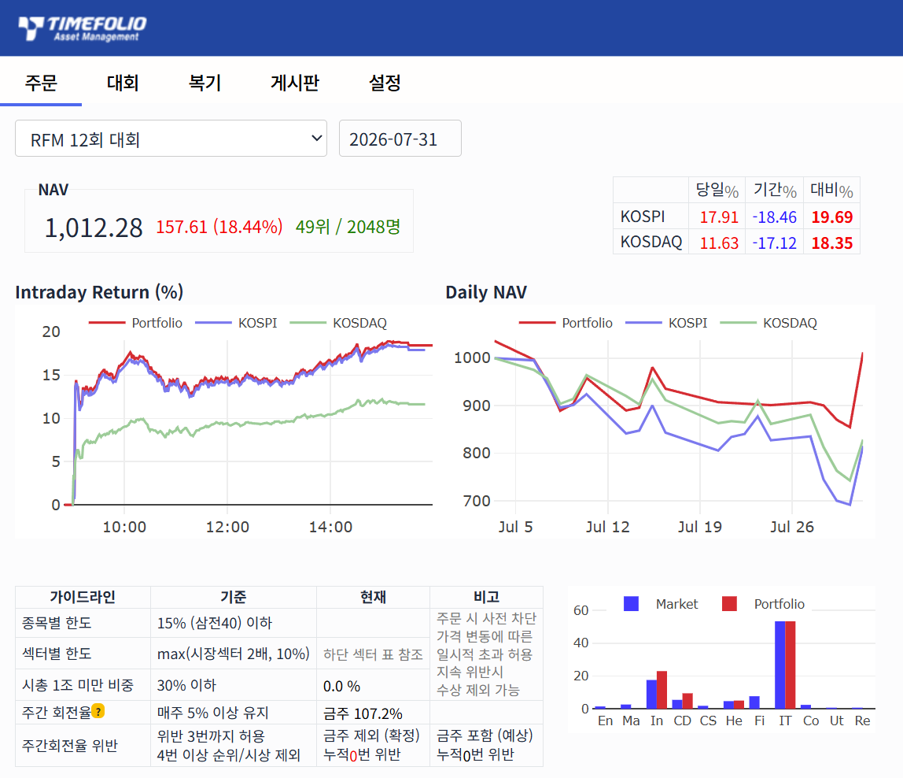

두 달간 진행되는 타임폴리오자산운용 'Road To Fundmanager' 대회가 어느덧 반환점을 돌았습니다. 중간 점검 겸 현재 상황을 복기해 봅니다.

현재 순위는 49위입니다. 49위라는 숫자가 재미있는 이유는, 대회 규정상 1위부터 49위까지만 포트폴리오가 투명하게 공개되기 때문입니다. 상위권 참가자들의 전략을 엿볼 수 있는 커트라인에 턱걸이했다는 점에서 소소한 의미를 두고 있습니다.

저번 대회에서는 직접 구축한 [API Wrapper](https://github.com/DART-KNU/timefolio-engine.git)를 이용해 지수를 추종하거나, 필요시 전량 매도하는 등의 활용을 하였습니다. 이번장에서는 자동화매매를 크게 활용하지는 않았습니다.

요즘 장세를 보면 그 어느 때보다 수급의 영향력이 큽니다. 텔레그램 등 여러 채널을 보면 옵션 시장 동향을 통해 수급을 분석하시던데, 저 역시 이 부분의 중요성을 크게 느끼고 있습니다. 다음 대회부터는 이런 부분도 함께 다루어보려고 합니다.

# 1. 복기

## 1.1. 단상

### 1.1.1. 주식은 영원히 오르지 않는다.

주식으로 큰 돈을 지속적으로 벌 수 있다면 누가 노동을 하고 누가 예금을 할까? 경제를 지탱하는 것은 결국 실물 시장이다. 모두가 모니터 앞에서 주식만 하고 아무도 공장에 가거나 서비스를 제공하지 않는다면, 실물 경제는 무너진다. 은행에 예금이 모이지 않으면 신용 창출 시스템이 작동하지 않는다. 또한 안전자산에 대한 수요가 감소하여 기업이나 국가의 자금조달이 어려워질 수 있다. 중앙은행과 경제 시스템은 자산 시장의 영원한 상승을 용인할 수 없다. 안전 자산과 위험 자산 사이의 밸런스가 유지되려면 주식 시장은 반드시 크게 잃을 수도 있는 위험한 곳이라는 공포감을 주기적으로 심어주어야 한다.

### 1.1.2. 절대 돈을 잃지 마라

하락장에서 재기 불가능할 만큼 패배했다면 그 다음 싸움을 기약하기가 어렵다. 그 다음판에도 싸울 수 있을 만큼은 살아 있어야 하기에 리스크 관리는 중요하다.

# 1.2. 전체 복기

| 항목                 | 값                                 |
| -------------------- | ---------------------------------- |
| NAV (7/31)           | 1,012.28                           |
| 기간 수익률          | +1.23%                             |
| 코스피 / 코스닥 기간 | −18.46% / −17.12%                  |
| 초과수익             | **+19.69%p / +18.35%p**            |
| 순위                 | 49위 / 2,048명 (상위 2.4%)         |
| 7/31 당일(평가금)    | 포트폴리오 +18.44%, 코스피 +17.91% |

잃지 않는 것이 중요한 한달이었습니다. 공격을 피하면서 31일의 폭발적 상승장에 올라탔어야 했어서(사실 30일 장 마감에 포지션을 취해 놓아야 했던) 그 난이도가 높았다고 볼 수 있습니다.

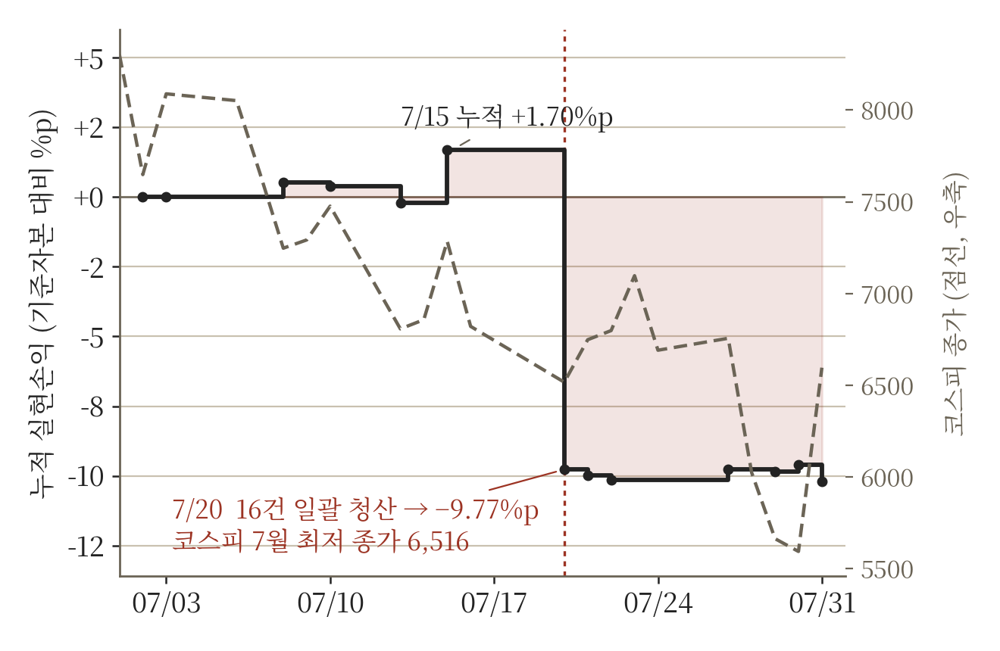

<small>**그림 1. 실현손익 경로 — 7월 20일 전량 청산 지점에서 곡선이 평평해집니다.**</small>

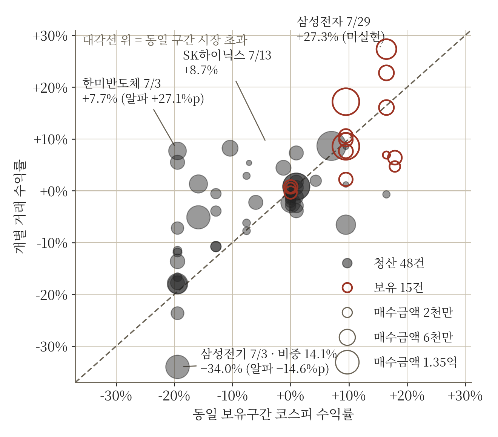

<small>**그림 2. 종목별 알파 산포 — 시장 수익률 대비 초과분의 분포.**</small>

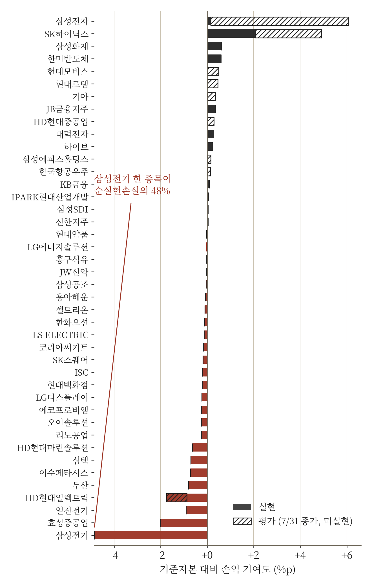

<small>**그림 3. 종목별 손익 기여도.**</small>

## 1.3. 시간대별 복기

### 7월 3일 — 최초 세팅

전력기기와 반도체 후공정 중심으로 짰습니다. IT 52.6%, 산업재 31.9%, 금융 14.0%.

| 종목           | 섹터 | 비중(%) |
| -------------- | ---- | ------- |
| 이수페타시스   | IT   | 14.56   |
| 삼성화재       | Fi   | 14.02   |
| 삼성전기       | IT   | 14.00   |
| 효성중공업     | In   | 12.00   |
| HD현대일렉트릭 | In   | 10.39   |
| 한미반도체     | IT   | 7.59    |
| 두산           | In   | 5.46    |
| 심텍           | IT   | 5.11    |
| 대덕전자       | IT   | 4.92    |
| 일진전기       | In   | 4.07    |
| 리노공업       | IT   | 3.37    |
| ISC            | IT   | 1.50    |
| 코리아써키트   | IT   | 1.50    |
| 오이솔루션     | IT   | 1.50    |

### 7월 20일 — 항복

전 종목 매도 주문을 체결했습니다. 근거는 단순했습니다. 차트상 반격이 전혀 먹히지 않는 것을 확인하고 전 종목에 대한 매도 주문을 채결하였습니다.

돌이켜보면 이 결정 하나가 성적의 대부분을 만들었습니다. 이후 시장은 훨씬 더 크게 빠졌고, 그때 저는 현금을 들고 있었습니다.

### 7월 28일 — 재진입

항복 후 조금씩 포지션을 늘려가던 중, 28일 오전 코스피가 −10.84%로 1989년 이후 네 번째로 크게 빠지는 것을 보고 본격적으로 다시 들어갔습니다

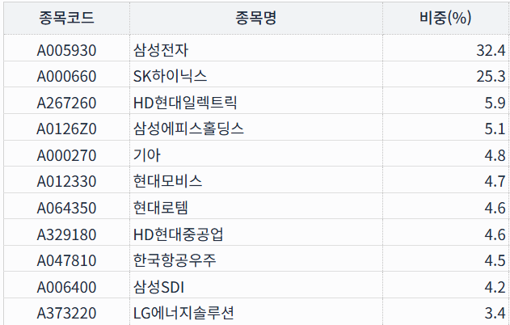

# 2. 앞으로는

## 2.1. 매크로

트럼프가 8월 1~2일 주말로 계획됐던 대이란 공습을 취소함. 공격 취소가 발표되면 국제유가가 하락 전환하고 비트코인이 반등하는 패턴이 반복되고 있음. 말을 번복하는 이유는 여러 가지겠지만, **가장 강하게 작동하는 제약은 미국채 금리로 보임.** 사슬은 이렇게 이어짐. 대이란 군사행동 → 유가 상승 → 헤드라인 인플레이션 → 연준 인상 압력 → 장기금리 상승 → 재정비용·자산가격 부담

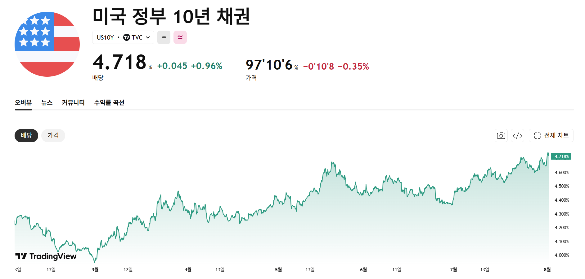

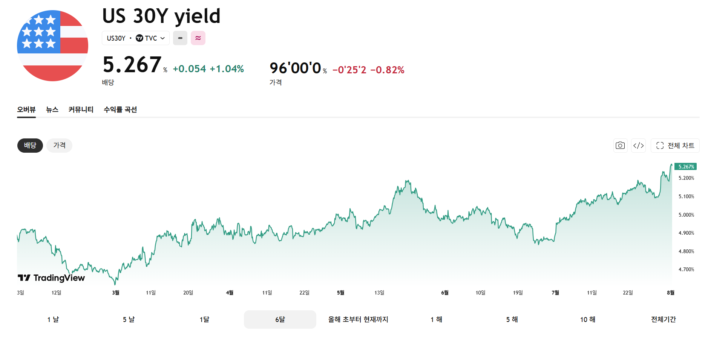

7월 29일 FOMC는 9대 3으로 정책금리를 3.50~3.75%에 동결. 인플레이션은 2% 목표를 5년 넘게 상회 중이며 최근에는 이란 전쟁과 에너지 가격이 주된 요인. 정책금리 3.50~3.75%가 고정된 상태에서 10년물과 30년물만 올라가고 있음. 정책 기대가 아니라 기간프리미엄과 인플레 리스크프리미엄이 밀어올리는 상승이라는 뜻. 워시가 포워드 가이던스를 의도적으로 주지 않는 것 자체도 반응함수 불확실성을 키워 기간프리미엄에 얹힘.

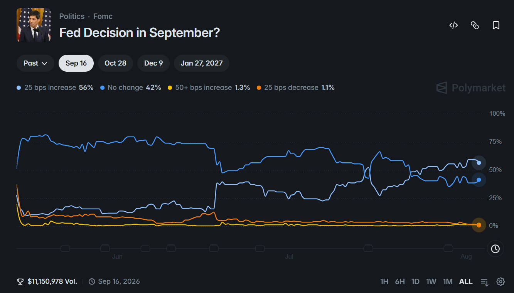

연준은 7월 FOMC에서 시장의 금리인상 우려를 굳이 진정시키지 않음으로써 시장 주도의 긴축을 유도헀다고 밝힘. 이는 실제 인상이 뒤따르지 않는다는 사실이 확인되면 그 긴축효과도 빠르게 반전될 수 있음을 시사함.

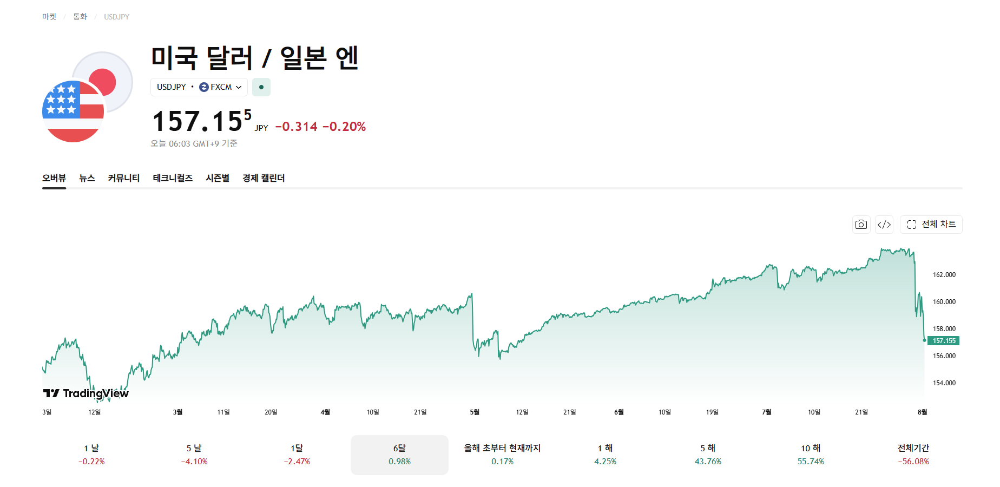

일본은 최근 3개월 동안 미국채 보유액을 960억 달러 줄여 1조 1,400억 달러로 축소. 중국도 지속적으로 축소하며 달러 자산 다변화를 이어가고 있음. 한편 일본 재무장관은 도쿄와 워싱턴이 엔화 약세를 막기 위한 공동 조치를 4일 발표할 예정이라고 언급.

두 사실을 붙여 읽으면 **엔화 방어를 지원할 테니 미국채 매도를 멈추라는 거래로 해석 가능함**(해석이며 공식 발표된 연계는 아님). 장기물 상승의 상당 부분이 수급 요인이라면 이 협상의 성패가 30년물에 직접 반영될 것.

8월 2일 OPEC+는 9월 원유 생산쿼터를 하루 18만 8천 배럴 확대하기로 합의. 공습 취소와 같은 방향으로 유가 하방 압력.

**따라서 단기적으로 트럼프는 크게 할 수 있는 것이 없으며, 전쟁으로 인한 영향을 이제 제한적일 것이라는 생각.**

## 2.2. 삼성전자와 하이닉스

한국 메모리가 저평가받아 온 이유는 크게 두 가지였음.

1. **사이클 산업** — 이익의 지속성을 신뢰받지 못함
2. **코리아 디스카운트** — 지배구조·주주환원 할인

지금 다투는 것은 첫 번째임. PER이 낮다는 사실만으로 저평가를 주장할 수 없고 **현재 이익의 지속성이 인정되느냐가 중요**. 사이클 산업의 저PER은 통상 이익 정점의 신호로 읽히기 때문.

이른바 '400만 닉스' 리포트(2026년 5월, NOMURA)의 구조를 뜯어보면 짚을 점이 있음. **목표주가 상향분이 이익 상향에서 온 것이 아님.** 같은 보고서에서 삼성전자의 2026~28년 영업이익 전망은 오히려 14%·6%·3% 하향됐음. 올라간 것은 목표배수임.

즉 이 강세론은 **"이익의 질이 달라졌으니 같은 이익에 더 높은 배수를 줘야 한다"**는 주장. 근거는 LTA(장기공급계약) — 3~5년 최소 계약기간, 선급금, 캐파 투자 지원이 결합돼 해지가 어렵고, 현금흐름이 사이클에서 계약 기반으로 이동했다는 논지.

CXMT는 **7월 27일 상하이 과창판에 상장**했음. 중국 DUV 노광장비 개발소식과 엔비디아 순환투자 논란과 함께 투매가 시작됨. 

CXMT는 공모가 8.66위안에 신주 66억 8,800만주를 발행해 **579억 위안(약 12.5조원)**을 조달했음. 초과배정 옵션까지 행사되면 666억 위안(약 14.4조원). 조달 자금은 생산라인 확장과 D램 기술 고도화에 투입한다고 밝힘. 이는 하이닉스 연간 투자의 30% 규모로 치명적이라 볼 수는 없음. 또한 기술과 점유율에는 여전히 상당한 격차가 존재함. 

해당 전망표대로라면 **2027~28년 두 해 동안 세계 커머디티 DRAM 웨이퍼 캐파 증가분의 약 55%가 CXMT에서 나옴** (Memory players' wafer capacity until 2028F, NOMURA).

|           |  2024 |  2025 | 2026F | 2027F | 2028F |
| --------- | ----: | ----: | ----: | ----: | ----: |
| 전체 DRAM | 1,723 | 1,990 | 2,264 | 2,629 | 2,981 |
| HBM       |   181 |   380 |   490 |   700 |   900 |
| 커머디티  | 1,542 | 1,610 | 1,774 | 1,929 | 2,081 |
| CXMT      |   200 |   280 |   330 |   400 |   500 |

| 연도  | CXMT 증설 | 비CXMT 커머디티 증설 |
| ----- | --------: | -------------------: |
| 2025  |       +80 |              **−12** |
| 2026F |       +50 |                 +114 |
| 2027F |       +70 |                  +85 |
| 2028F |      +100 |              **+52** |

(출처: NOMURA)

삼성전자와 하이닉스 이익의 대부분이 커머디티임. 불론 HBM이 있지만 DRAM 이익의 20% 선에 닿는 것은 2027년 후. 현재 이익 모델은 커머디티 DRAM의 역사적 고수익성이 2028년까지 유지된다는 전제. LTA의 구속력이 끝나는 갱신시점에 대안 공급자가 테이블에 앉아 있을 수도 있다는 것.

따라서 다음 죽음의 2지선다가 발생함.

**시나리오 A — 커머디티 가격이 높은 수준에서 유지** 이익은 지속되지만 같은 가격이 CXMT의 증설 유인이 됨. 캐파 전망대로면 2028년 24% 점유율이고 LTA 갱신 시점에 협상력이 이동함.

**시나리오 B — AI 투자 둔화, 커머디티 가격 급락** CXMT는 탈락 가능성이 커지지만 그 국면에서는 메모리 3사 이익도 함께 깨짐.

**높은 가격은 경쟁을 부르고 낮은 가격은 이익을 깎음.** 어느 쪽도 장기 해법이 아니며, 이것이 사이클 산업이 저배수를 받아 온 이유 그 자체임.

또한 현재 미국채 10년물과 30년물의 금리가 각각 4.72%와 5.27%이므로 이로 인한 할인율 을 적용하면 당초 보고서의 TP 보다 10%정도 낮아짐.

**아래 디레버리징의 논리와 결합해, 삼성전자와 하이닉스의 시장 영향도 줄었으므로 이를 보유할 유인이 약해짐.**

## 2.3. 디레버리징

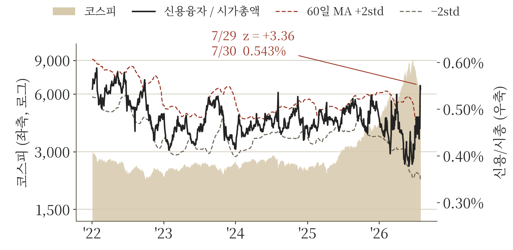

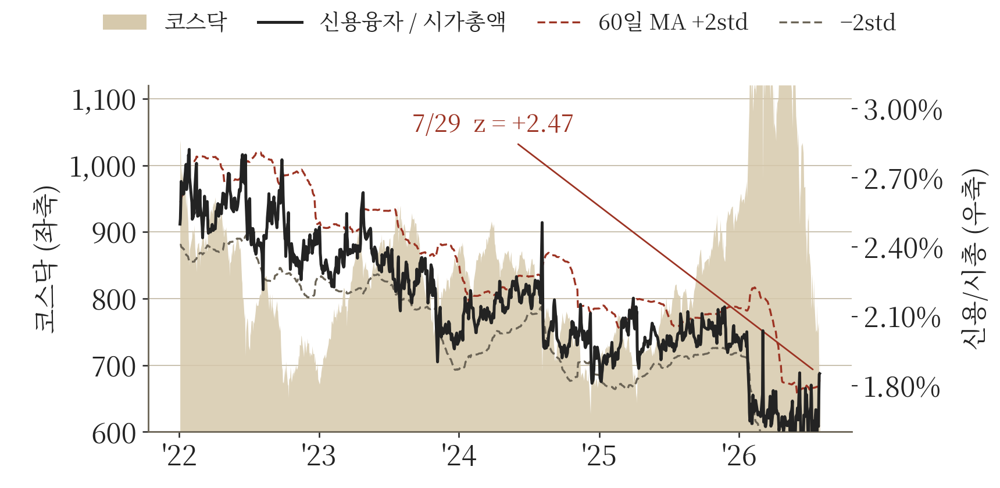

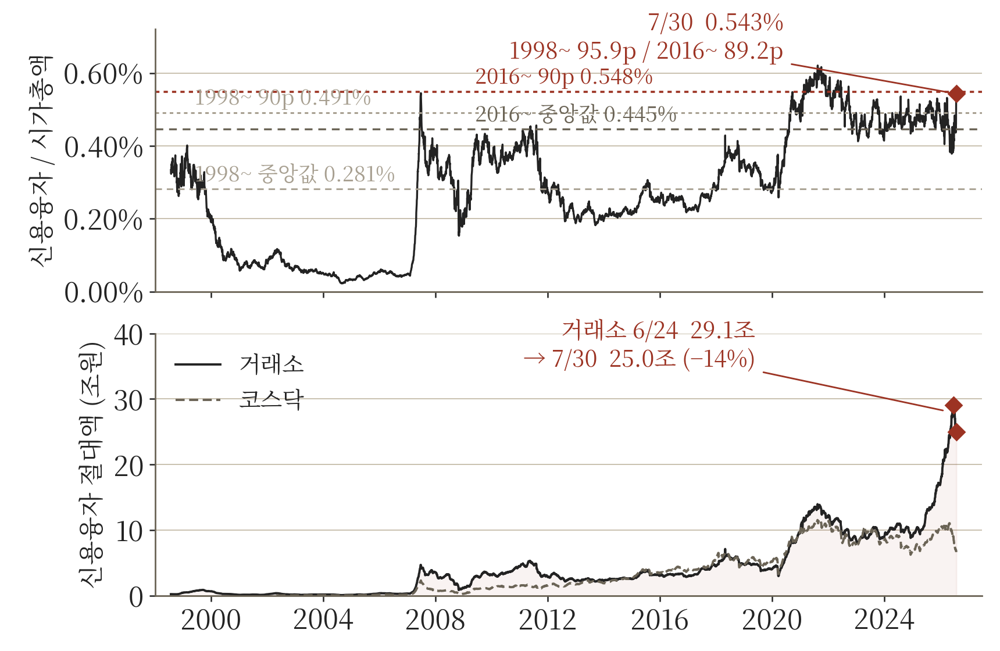

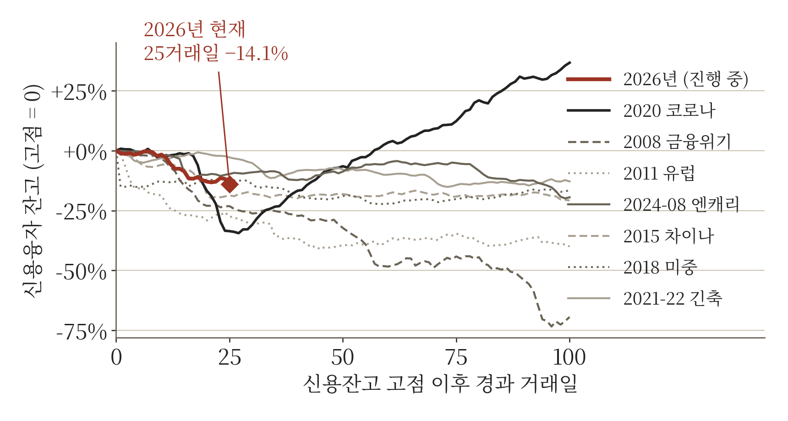

| 국면           | 신용 25일  | 코스피 25일 | 탄력성   |
| -------------- | ---------- | ----------- | -------- |
| 2008 금융위기  | −23.2%     | −11.2%      | 2.06     |
| 2011 유럽      | −27.6%     | −10.0%      | 2.76     |
| 2015 차이나    | −18.7%     | −6.1%       | 3.06     |
| 2020 코로나    | −33.6%     | −22.9%      | 1.47     |
| 2024-08 엔캐리 | −9.8%      | −4.8%       | 2.05     |
| **2026 현재**  | **−14.1%** | **−34.0%**  | **0.41** |

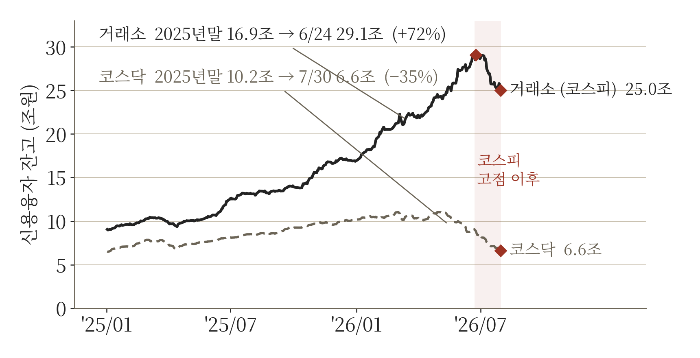

< 위 7개 표 및 차트 출처: Dataguide, 저자>

신용잔고가 의미있게 하락한 것은 아니다.  코스피가 크게 올라 대비로 보면 큰 의미는 없어보임. 그러나 신용융자 잔고는 분명 급격히 상승한 것은 맞음. 단기적으로 투자자는 마진콜이 발생하더라도 이를 흡수할 수 있는 여력이 있기 때문에(주가 하락 시 바로 디레버리징을 해야하지 않음) 신용잔고의 중요도가 낮아보임

7월 28일 코스피가 −10.84%로 1989년 이후 네 번째로 크게 빠진 날, 신용잔고는 25.37조에서 **25.80조로 오히려 늘었음**(+0.43조). 신용융자 잔고는 대출 원금 기준이라 주가가 내려도 자동으로 줄지 않으므로, 늘었다는 것은 그날 신규 융자 매수가 들어왔다는 뜻임. CXMT 충격 당일에 레버리지 저가매수가 붙은 것.

낮은 탄력성은 두 가지로 읽힘. 청산이 아직 오지 않았거나, **애초에 이 채널이 강제 청산 채널이 아니었거나**임.

후자를 지지하는 구조적 이유가 있음. 레버리지 ETF는 가격이 내리면 순자산이 줄고, 순자산이 줄면 다음 하락일에 기계적으로 팔아야 할 금액도 함께 줄어듦 — **하락이 문제를 스스로 줄임.** 신용융자는 반대로 가격이 내려도 대출 원금은 그대로이고 담보만 줄어듦 — **하락이 문제를 키움.** 다만 신용융자에는 추가 담보 납입과 재량이라는 완충이 있어 강제 매도가 즉각 일어나지 않음.

즉 신용잔고는 재고(stock) 지표이지 이번 국면의 유량(flow) 지표가 아니었음. 단기적으로 투자자가 마진콜을 흡수할 여력이 있다면 신용잔고의 중요도는 낮아짐.

디레버리징 관련해서 중요하게 봐야할 것은 1) 레버리지 ETF의 운용자산 2) 헤지펀드 레버리지 3) 외국인 자금 유출

한국 시장은 6월 중순 이후 격심한 디레버리징(부채 축소) 기간을 거쳤음. 일산적인 펀더멘털 우려와 순환매(로테이션) 자금 흐름으로 시작된 이번 하락은 레버리지 ETF에 의해 증폭되었으며, 최근 며칠 동안은 헤지펀드의 포지션 청산(unwind) 특징이 더욱 뚜렷하게 나타났음. 당사는 현재 레버리지 ETF 청산이 완료되었으며 헤지펀드 또한 디레버리징의 약 90%를 마쳤다고 판단.(JPM)

한국 주식을 기초자산으로 하는 레버리지 ETF의 영향으로 이러한 변동성이 생겼고

해당 부분이 정상화 되었다면 변동성이 축소될 것으로 보임.

# 3. 여담

모의투자만의 특성을 활용한 알파전략을 탐색중입니다. 수익을 적극적으로 내려고 하면서 이것저것 실험도 많이 해봤는데, 어느정도 진정되면 해당 부분도 포스팅 해보도록 하곘습니다. 그리고 투자하는게 지금은 뇌동매매가 많지만 점차점차 시스템화 해나갈 생각입니다.
